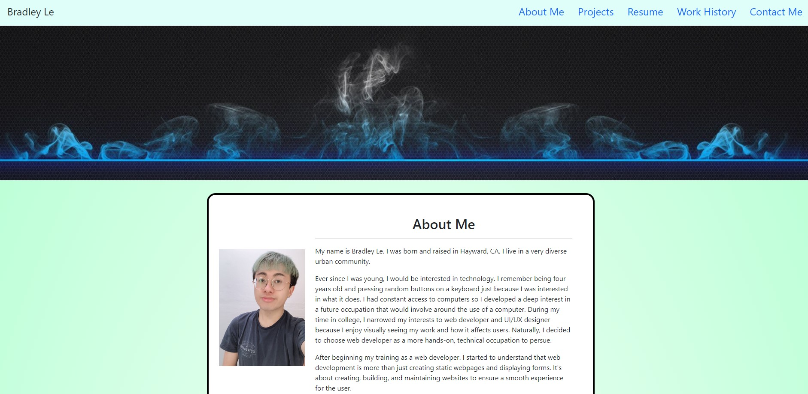

# portfolio-version-3

This is my portfolio updated with my work history and new projects and apps.

## Built With

* [HTML](https://developer.mozilla.org/en-US/docs/Web/HTML)
* [CSS](https://developer.mozilla.org/en-US/docs/Web/CSS)
* [Bootstrap CSS Framework](https://getbootstrap.com/docs/5.1/getting-started/introduction/)

## Deployed Link

* [See Live Site](https://pentazoned.github.io/portfolio-version-3/)

## Screenshots and GIF

* 

Navigating through the portfolio.

* 

What the user views when the first enter the webpage.

* 

The last project shown and my contact information.

## Authors

* **Bradley Le** 

- [Link to Portfolio Site](https://pentazoned.github.io/portfolio-version-3/)
- [Link to Github](https://github.com/PentaZoned)
- [Link to LinkedIn](https://www.linkedin.com/in/bradley-le-/)

## License

This project is licensed under the MIT License

## Acknowledgements

A big thank you to my Career Material Advisor from BootCampSpot for helping me revise my resume.